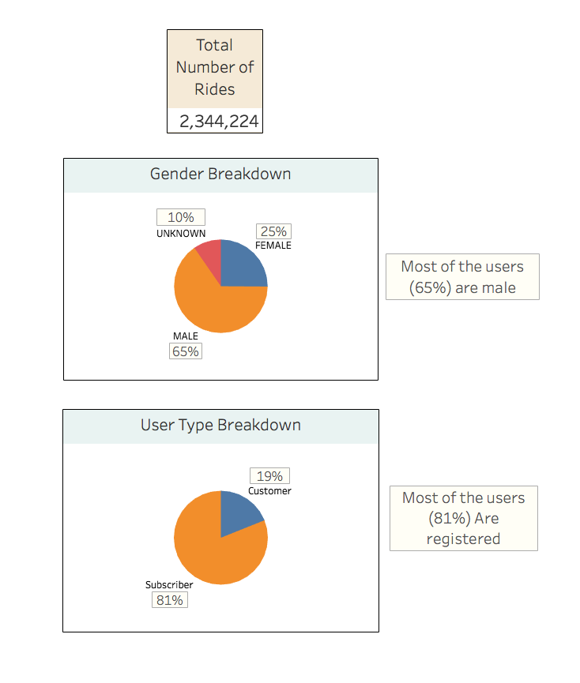

# **bikesharing**  

## **Overview of Project**
In this project we are creating some visualizations to present the story of the data obtained from a bike sharing program in New York City called CitiBike

### **Purpose**

Our source data for this project is a CSV file that contains more than 2 million records of rides  during the August of 2019. A view of this data file can be seen in [Fig. 1](Visualizations/data.png) 

|*Fig. 1: a sample of the source file*|
:--:
||

&nbsp;

Using the provided dataset, visualizations were created to interpret and analyse some aspects of the available information. in the following parts of this report we will review and describe these visualizations.  
The link to these visualizations is: [CitiBike Visualizations](https://public.tableau.com/views/Citibike_Challenge_16121585044230/CitiBikeChallenge?:language=en&:display_count=y&:origin=viz_share_link "link to Tableau Public server")
&nbsp;

## **Results**  

In this project we used Tableau Public to create worksheets, dashboards and finally a story to generate our visualizations and present the analysis and the story of the data.  
the first visualization created for this report can be seen in [Fig. 2](Visualizations/1.png):

|*Fig. 2: Number of rides and the share of different genders and user types)*|
:--:
||

&nbsp;

As you can see in the image above the total number of the rides in August of 2019 is 2,344,224 and based on the data 65% of the riders are male users, 25% are female and only 10 percent of the users are of unknown sex. Another thing we investigated is the number of rides took by different types of the users, based on the provided data there are two types of users: subscribers(registered users) and costumers (non registered users) as the graph in the image shows, more than 80% of riders are subscribers.
&nbsp;

In this dataset we also have some information about starting and ending station of each ride such as the coordinate, station name etc. using this information a visualization was created that is shown in [Fig. 3](Visualizations/2.png):

|*Fig. 3: Top starting and ending stations*|
:--:
||

&nbsp;

In this figure each bubble is the location of a station, the size of the bubbles and the intensity of their color illustrate the number of the rides registered for that station. Out of more than 800 stations throughout the New York City those that are located in Manhattan are used more often. May be because it is most the interesting part of the city. The most popular station among all is "Pershing Square North" both as an origin and a destination. This station is also located in Manhattan.
&nbsp;

We also have some information about the duration of each ride. In the next graph ([Fig. 4](Visualizations/3.png)) we are trying to find if there is any relation between the age of the riders and the trip duration

|*Fig. 4: Average trip duration Vs. birth year*|
:--:
||

&nbsp;

in this graph, there are fluctuations in data regarding the trip duration but despite that, we can see a general trend as the younger riders had  longer trips

 using trip duration data we tried to figure out how many bikes were out (which is actually equal to the number of rides) for a certain checkout time. For that purpose the graph in [Fig. 5](Visualizations/4.png) was created

|*Fig. 5: Number of rides for checkout times*|
:--:
||

&nbsp;

as you can see in [Fig. 5](Visualizations/4.png) the data (trip duration) in this chart can be filtered for desired trip durations (in hour), in this figure we filtered the data for trip durations less than 3 hours. There is a sharp increase in the number of rides up to the trip durations of 5 minutes but after that we can see a sudden drop in the number of rides, we never had more than 1000 rides for trip durations more than 1 hour and more than 100 rides for trips longer than 2 hours. According to this graph, more than 75% of trip durations were less than 20 minutes.
&nbsp;

Next, we added the gender of the users to this graph and categorized the data to evaluate the performance of each gender([Fig. 6](Visualizations/5.png)) 

|*Fig. 6: Number of rides for checkout times for each gender*|
:--:
||

&nbsp;

It can be seen in [Fig. 6](Visualizations/5.png) that the general trend of the data is the same as what we saw in the Fig. 5. there is still a sharp rise followed by a significant drop in the number of rides for the trips shorter than 1 hour. But, the slope of the drop becomes less steep as we go from the male users to females and then unknowns. If we set the 20 minutes trips as the point of comparison we can say that more than 75% of the rides lasted less than 20 minutes when the riders were men, 80% of women had trips shorter than 20 minutes and for the users whose gender is unknown 55% of trip durations were less than 20 minutes.
&nbsp;

A heatmap were generated to find the number of the trips during each weekday in august ([Fig. 7](Visualizations/6.png)):

|*Fig. 7: Number of trips by weekday per hour*|
:--:
||

&nbsp;

[Fig. 7](Visualizations/6.png) illustrates that from Monday to Friday, most of the trips were made between 6-9 AM and 4-8 PM. Because these days are business days we can say that people are using the bikes in the morning for going to work and again in the evening to go back home. But, on Saturdays and Sundays the rides were mostly took from 9 AM to 7 PM as riders were using the bikes during their leisure hours on weekends.
&nbsp;

In [Fig. 8](Visualizations/7.png) we added the gender of the riders to the heatmap we described in Fig. 7. The general look for each gender is similar to what we had before for all users. using this graph we can say that in the peak hours most of the riders were men.

|*Fig. 8: Number of trips by gender and weekday per hour*|
:--:
||

&nbsp;

In [Fig. 9](Visualizations/8.png), using another heatmap we are showing the number of rides for each gender in each user type group (subscribers or registered users and costumers or non registered users):

|*Fig. 9: Number of trips for each user type by gender by weekday*|
:--:
||

&nbsp;

According to this figure, men had the most number of trips in the subscribers group (registered users). The same can be said for those whose gender is known in the costumers group (non registered users).this graph also shows that in subscribers group wednesday, Thursday, Tuesday and Monday are respectively the days with the most number of rides while in the costumers group most of the trips were made on Saturday and Sunday.

## **summary**  

- Based on what we discussed in previous section it seems that the bike sharing program in New York city is well-received by both the residents of the city and tourists (non registered users are more likely to be tourists). As we mentioned earlier there were almost 2.35 million rides in the august of 2019, that roughly means around 76,000 trips per day. People of all ages used the bikes for leisure or as a commuting device.
- In addition to the visualizations we already presented, we could have created some more graphs to explore the data more deeply. For example one to show the average trip duration for each gender by weekday. Look at the [Fig. 10](Visualizations/A1.png), it shows that among the users whose gender is known women had longer trips.

    

    |*Fig. 10: Average trip duration for each gender by weekday*|
    :--:
    ||
    

    &nbsp;

  Another visualization that can be made is one that shows the average trip duration for each user type ([Fig. 11](Visualizations/A2.png)), this figure contains two graphs the first one illustrates that the average trip duration for non registered users is almost three times higher than subscribers. in the second chart we can see the reason for that, this chart shows the number of the rides for each trip duration and it is filtered to show only the result for the trips longer than 1 hour and shorter than 3 hours as you can see the line that represents the data regarding non registered users (costumers) is higher in this interval. 

    

    |*Fig. 11: Average trip duration and the number of trips for checkout times for each user type*|
    :--:
    ||
    

    &nbsp;